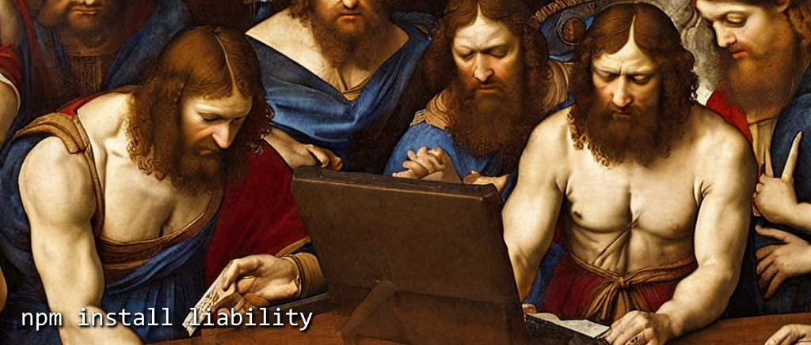

# This package is a liability

It triggers vulnerabilities and deprecations. So you better update - constantly.

| severity 	| package@version 		|
| -------- 	| --------------- 		|
| critical	| lodash@4.17.4			|
| high 		| lodash@4.17.20		|
| moderate 	| swagger-ui-dist@4.1.2	|
| low 		| timespan@2.3.0		|

